

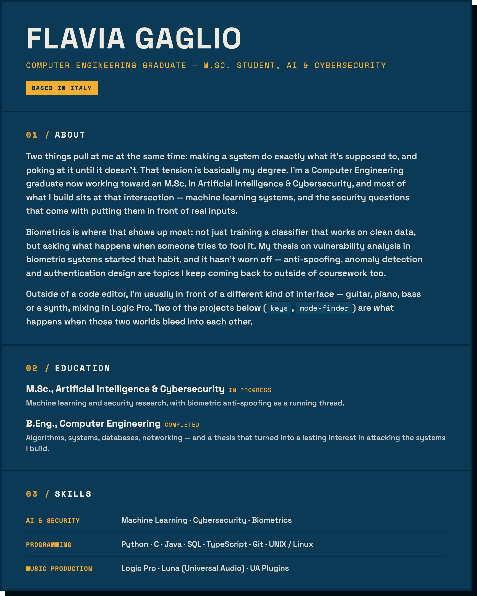

  

  

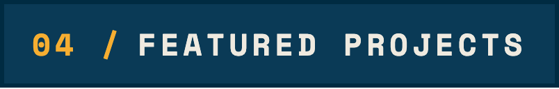

 

Full write-ups, architecture notes and honest limits for every project are on the portfolio. These seven are the ones I'd point you to first.

<table width="100%">

<tr>
<td width="45%" valign="middle">

**🗺️ Cartographer**
Client-side Music Information Retrieval tool — extracts timbral features (MFCC, centroid, energy) from dropped audio files and projects them into a 2D acoustic map via UMAP, so acoustically similar sounds cluster together. No server, no upload: decoding, analysis and projection all run in the browser.

`JavaScript` `Web Audio API` `UMAP`

</td>
<td width="55%">
<a href="https://flaviagaglio.github.io/cartographer/">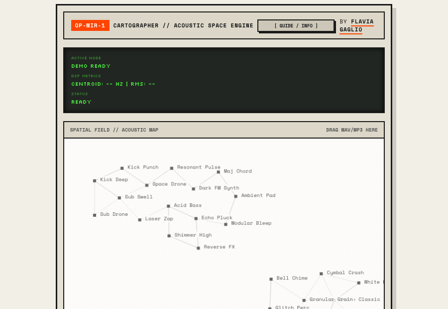</a>
</td>
</tr>

<tr>
<td width="55%">
<a href="https://flaviagaglio.github.io/kepler0/">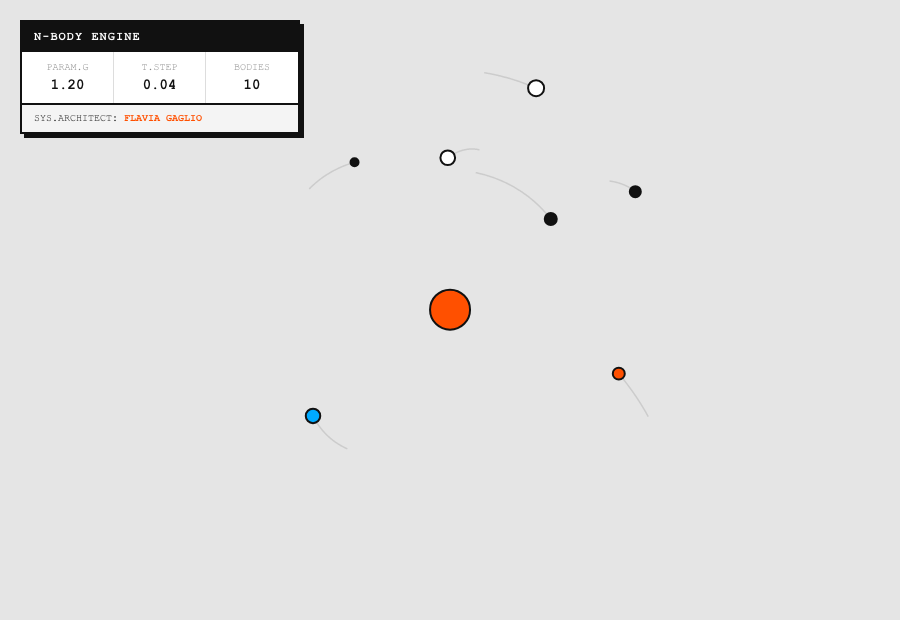</a>
</td>
<td width="45%" valign="middle">

**🪐 Kepler0**
Real-time N-body gravitational simulator: every body attracts every other body under Newtonian gravity, integrated frame by frame, with a softening factor that keeps close encounters numerically stable instead of ejecting bodies at infinite velocity. Inject mass and watch orbits and chaos emerge live.

`JavaScript` `HTML5 Canvas` `Numerical Simulation`

</td>
</tr>

<tr>
<td width="45%" valign="middle">

**🩺 Male Infertility Prediction**
Classifying Controls vs. Infertile subjects from clinical andrology data: 13 tuned model configurations across Decision Trees, MLP, SVM and gradient-boosting ensembles, validated with repeated/nested cross-validation and statistical significance testing rather than a single accuracy number.

`Python` `scikit-learn` `XGBoost` `SHAP`

</td>
<td width="55%">
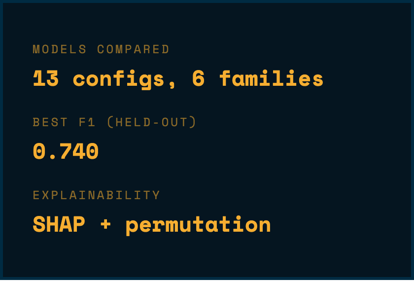
</td>
</tr>

<tr>
<td width="55%">
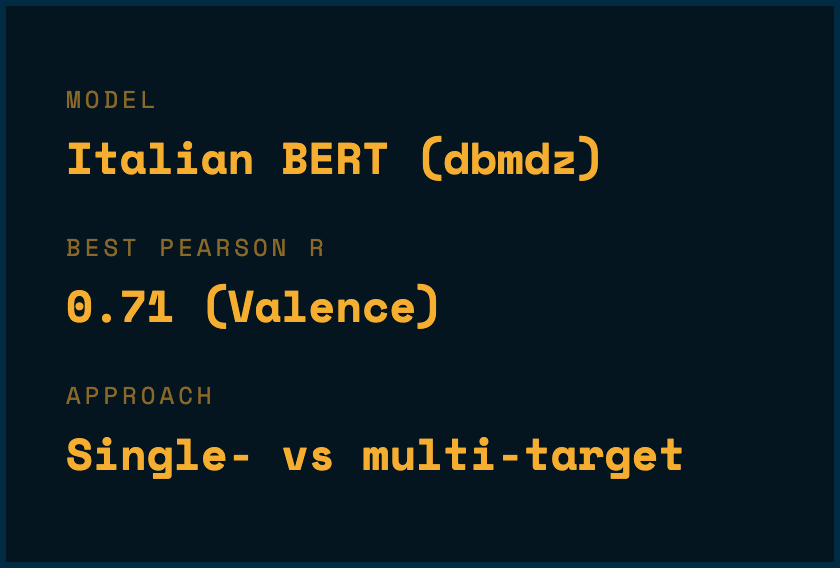
</td>
<td width="45%" valign="middle">

**💬 Emotion Detection in Italian Text**
Fine-tuned Italian BERT for VAD emotion regression (Valence, Arousal, Dominance) on the EmoITA dataset — three single-target models compared head-to-head against one joint multi-target model, rather than assuming one approach wins.

`Python` `PyTorch` `BERT` `NLP`

</td>
</tr>

<tr>
<td width="45%" valign="middle">

**🎹 Keys**
Instant key signature finder built on real circle-of-fifths math: pick a tonic, get the exact number and letter names of its sharps or flats, computed algorithmically rather than looked up from a table.

`JavaScript` `Music Theory`

</td>
<td width="55%">
<a href="https://flaviagaglio.github.io/keys/">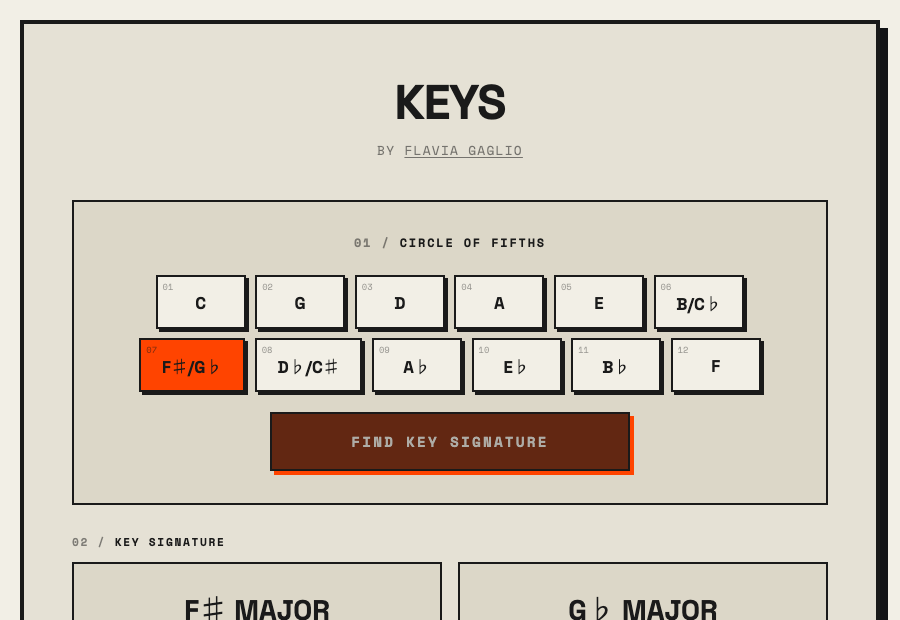</a>
</td>
</tr>

<tr>
<td width="55%">
<a href="https://flaviagaglio.github.io/mode-finder/">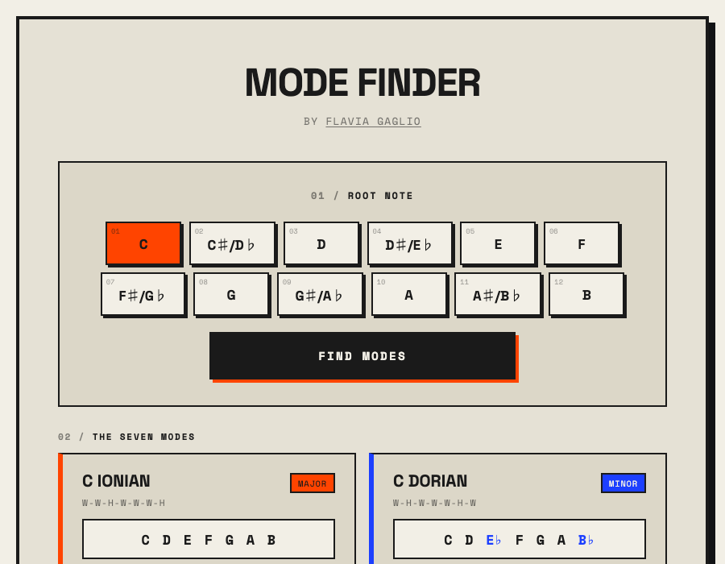</a>
</td>
<td width="45%" valign="middle">

**🎼 Mode Finder**
All seven modes of the major scale on any root note, spelled correctly: the algorithm steps through the musical alphabet one letter per degree — never repeating or skipping one — and picks whichever enharmonic spelling needs the fewest accidentals for each mode independently.

`JavaScript` `Music Theory`

</td>
</tr>

<tr>
<td width="45%" valign="middle">

**🔐 Passwords**
Password generator built on a cryptographically secure RNG (Web Crypto API with rejection sampling to avoid modulo bias, not `Math.random()`), with a strength meter that shows real Shannon entropy in bits instead of an arbitrary score.

`JavaScript` `Web Crypto API`

</td>
<td width="55%">
<a href="https://flaviagaglio.github.io/passwords/">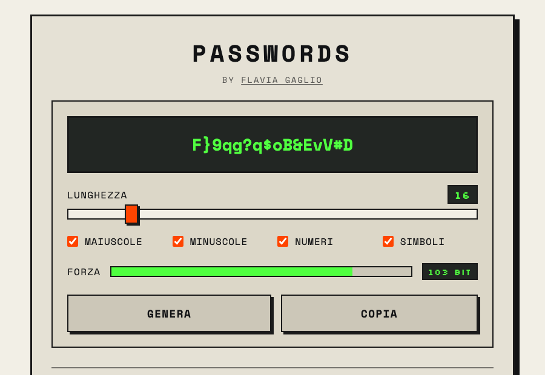</a>
</td>
</tr>

</table>

  

 

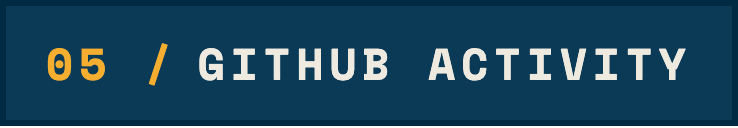

  

 

  

  

<picture>
  <source media="(prefers-color-scheme: dark)" srcset="https://raw.githubusercontent.com/flaviagaglio/flaviagaglio/output/snake-dark.svg">
  <source media="(prefers-color-scheme: light)" srcset="https://raw.githubusercontent.com/flaviagaglio/flaviagaglio/output/snake-light.svg">
  
</picture>

  

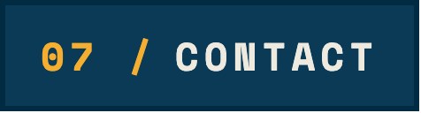

  

  

  

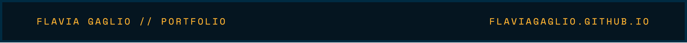

