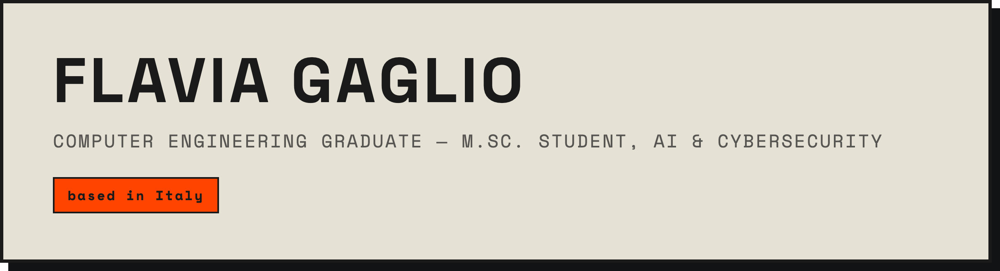
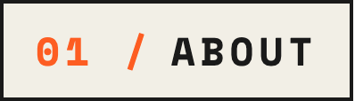
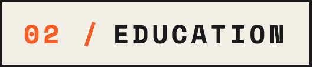
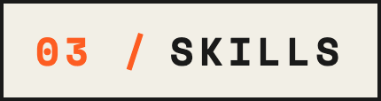
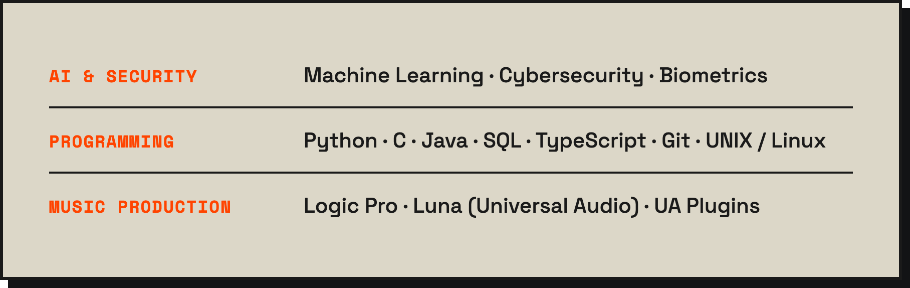

 

  

 

  

Two things pull at me at the same time: making a system do exactly what it's supposed to, and poking at it until it doesn't. That tension is basically my degree. I'm a Computer Engineering graduate now working toward an M.Sc. in Artificial Intelligence & Cybersecurity, and most of what I build sits at that intersection — machine learning systems, and the security questions that come with putting them in front of real inputs.

Biometrics is where that shows up most: not just training a classifier that works on clean data, but asking what happens when someone tries to fool it. My thesis on vulnerability analysis in biometric systems started that habit, and it hasn't worn off — anti-spoofing, anomaly detection and authentication design are the topics I keep coming back to outside of coursework too.

Outside of a code editor, I'm usually in front of a different kind of interface — guitar, piano, bass or a synth, mixing in Logic Pro. Two of the projects below (`keys`, `mode-finder`) are what happens when those two worlds bleed into each other.

 

  

**M.Sc., Artificial Intelligence & Cybersecurity** — *in progress*
Machine learning and security research, with biometric anti-spoofing as a running thread.

**B.Eng., Computer Engineering** — *completed*
Algorithms, systems, databases, networking — and a thesis that turned into a lasting interest in attacking the systems I build.

 

  

  

  

Full write-ups, architecture notes and honest limits for every project are on the portfolio. These seven are the ones I'd point you to first.

<table width="100%">

<tr>
<td width="45%" valign="middle">

**🗺️ Cartographer**
Client-side Music Information Retrieval tool — extracts timbral features (MFCC, centroid, energy) from dropped audio files and projects them into a 2D acoustic map via UMAP, so acoustically similar sounds cluster together. No server, no upload: decoding, analysis and projection all run in the browser.

`JavaScript` `Web Audio API` `UMAP`

</td>
<td width="55%">

</td>
</tr>

<tr>
<td width="55%">

</td>
<td width="45%" valign="middle">

**🪐 Kepler0**
Real-time N-body gravitational simulator: every body attracts every other body under Newtonian gravity, integrated frame by frame, with a softening factor that keeps close encounters numerically stable instead of ejecting bodies at infinite velocity. Inject mass and watch orbits and chaos emerge live.

`JavaScript` `HTML5 Canvas` `Numerical Simulation`

</td>
</tr>

<tr>
<td width="45%" valign="middle">

**🩺 Male Infertility Prediction**
Classifying Controls vs. Infertile subjects from clinical andrology data: 13 tuned model configurations across Decision Trees, MLP, SVM and gradient-boosting ensembles, validated with repeated/nested cross-validation and statistical significance testing rather than a single accuracy number.

`Python` `scikit-learn` `XGBoost` `SHAP`

</td>
<td width="55%">

</td>
</tr>

<tr>
<td width="55%">

</td>
<td width="45%" valign="middle">

**💬 Emotion Detection in Italian Text**
Fine-tuned Italian BERT for VAD emotion regression (Valence, Arousal, Dominance) on the EmoITA dataset — three single-target models compared head-to-head against one joint multi-target model, rather than assuming one approach wins.

`Python` `PyTorch` `BERT` `NLP`

</td>
</tr>

<tr>
<td width="45%" valign="middle">

**🎹 Keys**
Instant key signature finder built on real circle-of-fifths math: pick a tonic, get the exact number and letter names of its sharps or flats, computed algorithmically rather than looked up from a table.

`JavaScript` `Music Theory`

</td>
<td width="55%">

</td>
</tr>

<tr>
<td width="55%">

</td>
<td width="45%" valign="middle">

**🎼 Mode Finder**
All seven modes of the major scale on any root note, spelled correctly: the algorithm steps through the musical alphabet one letter per degree — never repeating or skipping one — and picks whichever enharmonic spelling needs the fewest accidentals for each mode independently.

`JavaScript` `Music Theory`

</td>
</tr>

<tr>
<td width="45%" valign="middle">

**🔐 Passwords**
Password generator built on a cryptographically secure RNG (Web Crypto API with rejection sampling to avoid modulo bias, not `Math.random()`), with a strength meter that shows real Shannon entropy in bits instead of an arbitrary score.

`JavaScript` `Web Crypto API`

</td>
<td width="55%">

</td>
</tr>

</table>

  

 

  

  

  

 

  

  <picture>
    <source media="(prefers-color-scheme: dark)" srcset="https://raw.githubusercontent.com/flaviagaglio/flaviagaglio/output/snake-dark.svg">
    <source media="(prefers-color-scheme: light)" srcset="https://raw.githubusercontent.com/flaviagaglio/flaviagaglio/output/snake-light.svg">
    
  </picture>

 

  

  
  
  

  

 

